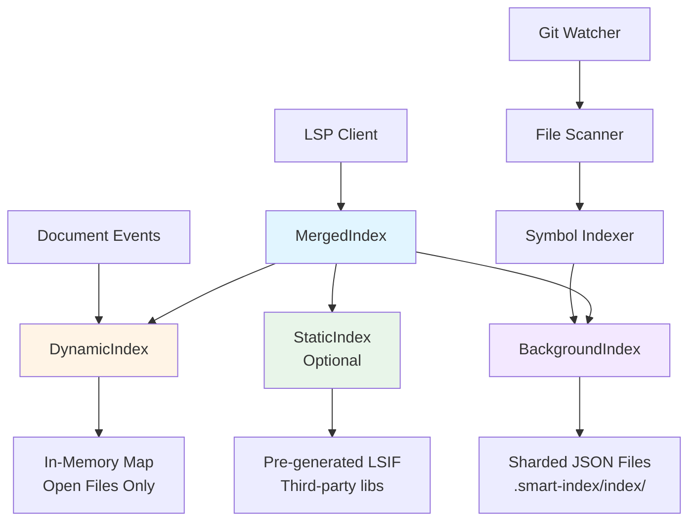
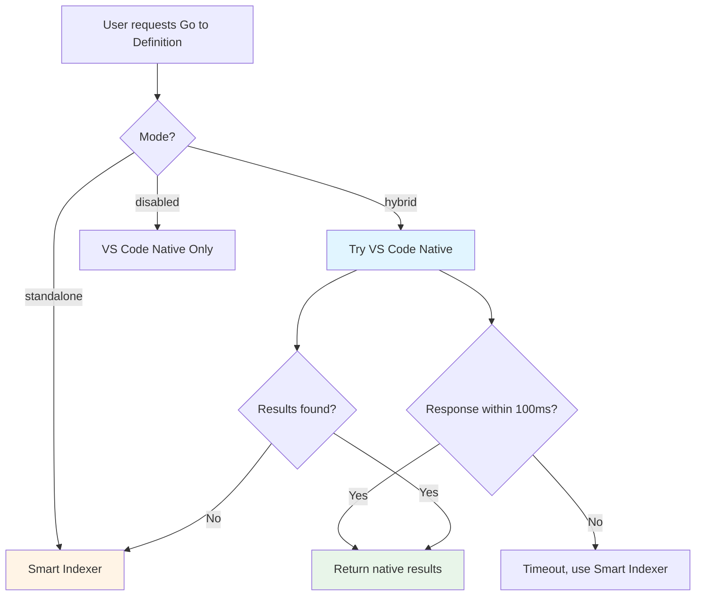

# Smart Indexer Architecture

## Overview

Smart Indexer is a VS Code extension that provides fast, persistent symbol indexing for TypeScript/JavaScript projects. It implements a **dual-index architecture** inspired by LLVM's clangd, combining in-memory dynamic indexing for open files with persistent background indexing for the entire workspace.

---

## Architectural Principles

### Core Design Goals

1. **Fast Cold Start**: Index data persists on disk, enabling instant navigation after VS Code restart
2. **Incremental Updates**: Only changed files are re-indexed (Git-aware)
3. **Memory Efficiency**: Sharded storage with lazy loading
4. **Scalability**: Designed for large monorepos (1000+ files)
5. **Multi-language Support**: TypeScript/JavaScript with optional text-based indexing for Java, Go, C#, Python, Rust, C++

### Inspiration: clangd

Smart Indexer's architecture is inspired by [clangd](https://clangd.llvm.org/design/indexing), the C++ language server:

- **DynamicIndex**: Fast in-memory index for currently open/edited files
- **BackgroundIndex**: Persistent on-disk index for the entire workspace
- **MergedIndex**: Unified query interface that combines both indices

---

## Dual-Index Architecture

### Component Overview



### 1. DynamicIndex

**Purpose**: Fast, in-memory index for currently open files.

**File**: `server/src/index/dynamicIndex.ts`

**Characteristics**:
- Stores symbols for open/edited files only
- Updated on every `textDocument/didChange` event (debounced 500ms)
- Automatically cleaned when files are closed
- No persistence (data lives in memory only)

**Data Structure**:
```typescript
private fileIndex: Map<string, IndexedSymbol[]>
```

**Update Flow**:
```
1. User opens file.ts
2. DynamicIndex.updateFile(uri, content)
3. SymbolIndexer parses AST
4. Symbols stored in fileIndex map
5. File closed → removed from map
```

**Query Performance**: O(1) file lookup, O(n) symbol filtering

---

### 2. BackgroundIndex

**Purpose**: Persistent, sharded index for the entire workspace.

**File**: `server/src/index/backgroundIndex.ts`

**Characteristics**:
- Indexes all files in workspace (respects exclude patterns)
- Stores symbols in per-file JSON shards on disk
- Lazy-loads shards from disk only when queried
- Supports parallel indexing (configurable worker pool)
- Survives VS Code restarts

**Storage Structure**:
```
.smart-index/
  ├── index/
  │   ├── a3f2b1c4.json    # Shard for file1.ts
  │   ├── d9e4c8f7.json    # Shard for file2.ts
  │   └── ...
  └── metadata.json        # Git hash, folder hashes, timestamps
```

**Shard Format**:
```json
{
  "uri": "/path/to/file.ts",
  "contentHash": "a3f2b1c4...",
  "symbols": [
    {
      "name": "MyClass",
      "kind": "class",
      "location": { "uri": "...", "line": 10, "character": 0 },
      "range": { "startLine": 10, "endLine": 20, ... },
      "containerName": null,
      "isStatic": false,
      "symbolId": "abc123..."
    }
  ],
  "timestamp": 1701234567890
}
```

**Indexing Flow**:
```
1. File Scanner finds all indexable files
2. Compare content hashes with existing shards
3. Queue changed files for indexing
4. Worker pool processes files in parallel
5. Write shards to .smart-index/index/
6. Update in-memory metadata and name index
```

**Query Performance**: O(1) shard lookup, O(k) lazy load from disk

---

### 3. MergedIndex

**Purpose**: Unified query interface combining all indices.

**File**: `server/src/index/mergedIndex.ts`

**Query Priority**:
1. **DynamicIndex** (open files) - highest priority
2. **BackgroundIndex** (workspace files) - fallback
3. **StaticIndex** (optional, pre-generated) - fallback

**Deduplication**:
Results are deduplicated by unique key: `(name, uri, line, character)`

---

## Hybrid Mode

### Overview

**Hybrid Mode** intelligently delegates navigation requests to VS Code's native TypeScript Language Service (tsserver) when available, falling back to Smart Indexer if tsserver is slow or unavailable.

**Configuration**:
```json
{
  "smartIndexer.mode": "hybrid",  // "standalone" | "hybrid" | "disabled"
  "smartIndexer.hybridTimeoutMs": 100
}
```

### Delegation Strategy



### Benefits

1. **Best of Both Worlds**: Type-aware accuracy from tsserver, fast fallback from Smart Indexer
2. **No Duplicate Results**: Only one provider active at a time
3. **Graceful Degradation**: Falls back seamlessly when tsserver is slow or unavailable
4. **User Control**: Configurable via `smartIndexer.mode` setting

---

## Import Resolver

### Purpose

Resolves imported symbols to their exact source files, eliminating false positives from name-based searches.

**File**: `server/src/indexer/importResolver.ts`

### Problem Statement

**Before Import Resolution**:
```typescript
import { Foo } from './bar';
const x = new Foo(); // Ctrl+Click on Foo
```
Smart Indexer would search for **all** symbols named `Foo` across the workspace, returning many false positives.

**After Import Resolution**:
Smart Indexer resolves `'./bar'` to the exact file, then searches only in that file for `Foo`.

### Resolution Logic

```typescript
class ImportResolver {
  resolveImport(moduleSpecifier: string, fromFile: string): string | null {
    if (moduleSpecifier.startsWith('./') || moduleSpecifier.startsWith('../')) {
      // Relative import: resolve to absolute path
      return this.resolveRelative(moduleSpecifier, fromFile);
    } else {
      // Package import: check node_modules
      return this.resolvePackage(moduleSpecifier, fromFile);
    }
  }
}
```

---

## Indexing Pipeline

### Symbol Extraction

**AST Traversal** (`server/src/indexer/symbolIndexer.ts`):

```typescript
export class SymbolIndexer {
  async indexFile(uri: string, content: string): Promise<IndexedSymbol[]> {
    const ast = parse(content, { loc: true, range: true, jsx: uri.endsWith('x') });
    const symbols: IndexedSymbol[] = [];
    const references: IndexedReference[] = [];
    
    this.traverseAST(ast, symbols, references, uri);
    return symbols;
  }
}
```

Extracts:
- Classes, interfaces, enums
- Functions, methods, properties
- Variables, constants
- Imports, exports
- References (identifier usages)

### Symbol Identity

Each symbol gets a unique ID based on metadata:

```typescript
function createSymbolId(
  uri: string,
  name: string,
  containerName: string | undefined,
  kind: string,
  isStatic: boolean | undefined,
  startLine: number,
  startCharacter: number
): string {
  const parts = [uri, containerName || '<global>', name, kind, 
                 isStatic ? 'static' : 'instance', 
                 startLine.toString(), startCharacter.toString()];
  return crypto.createHash('sha256').update(parts.join(':')).digest('hex').substring(0, 16);
}
```

---

## Performance Characteristics

### Startup Time

| Operation | Time | Notes |
|-----------|------|-------|
| Load metadata | ~5ms | JSON parse |
| Build name index | ~50ms | For 10,000 symbols |
| Lazy load shards | 0ms | On-demand |

**Total cold start**: <100ms for large projects

### Indexing Performance

| Workspace Size | Full Index | Incremental (10% changed) |
|----------------|-----------|---------------------------|
| 100 files | ~500ms | ~50ms |
| 1,000 files | ~5s | ~500ms |
| 10,000 files | ~50s | ~5s |

**With parallel indexing** (4 workers): 2-4x faster

### Query Performance

| Operation | Time | Notes |
|-----------|------|-------|
| findDefinitions | 5-20ms | Name-based index lookup |
| findReferences | 10-50ms | Per-file shard loading |
| searchSymbols | 20-100ms | With fuzzy matching |

---

## Trade-offs vs. Native TypeScript

### Smart Indexer Advantages

✅ **Persistent Index**: Survives restarts, instant cold start  
✅ **Fast Queries**: No type-checking overhead  
✅ **Works on Invalid Code**: Fault-tolerant AST parsing  
✅ **Scalability**: Sharded storage, lazy loading  
✅ **Multi-language**: Text-based indexing for Java, Go, etc.

### Smart Indexer Limitations

❌ **No Type Awareness**: Cannot resolve types, generics, overloads  
❌ **Import Resolution**: Limited compared to full module resolution  
❌ **Disambiguation**: Container-based heuristics, not semantic  
❌ **Cross-file Analysis**: Limited without full type graph

### When to Use Hybrid Mode

**Use Hybrid Mode when:**
- You want best accuracy for TypeScript/JavaScript
- You're willing to wait 100ms for tsserver
- You have a well-configured TypeScript project

**Use Standalone Mode when:**
- You need instant response times (<10ms)
- You're working with partial/invalid code
- You're indexing non-TypeScript languages

---

## Conclusion

Smart Indexer provides a **fast, persistent, scalable** alternative to native TypeScript indexing, with intelligent fallback via Hybrid Mode. The dual-index architecture balances memory efficiency with query performance, while the import resolver and symbol disambiguation improve accuracy beyond simple name-based searches.

**Key Insight**: Smart Indexer complements, rather than replaces, VS Code's native TypeScript service—offering instant cold start and working on invalid code, while delegating complex semantic queries when accuracy is critical.
