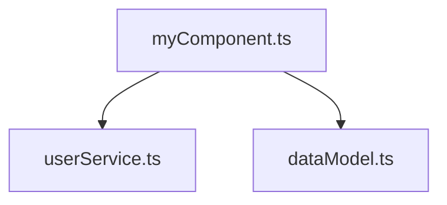

# Impact Analysis Feature

## Overview

The Impact Analysis feature provides a comprehensive dependency visualization and documentation system for Smart Indexer. It allows developers to explore how code changes affect their codebase and export dependency graphs for documentation.

## Architecture

### Server-Side Components

#### `DependencyGraphService` (`server/src/features/dependencyGraph.ts`)
- **Purpose**: Centralized logic for dependency analysis
- **Key Methods**:
  - `getDependencies(filePath, direction)`: Returns array of file paths with the specified dependency relationship
  - `buildDependencyTree(rootPath, direction, maxDepth)`: Builds a hierarchical dependency tree
  - `generateMermaidString(rootPath, direction, maxDepth)`: Generates a Mermaid diagram string

- **Dependency Directions**:
  - `incoming`: Files that depend on the target file (used by)
  - `outgoing`: Files that the target file depends on (uses)

### Client-Side Components

#### `DependencyTreeProvider` (`src/providers/DependencyTreeProvider.ts`)
- **Purpose**: VSCode TreeDataProvider for visualizing dependencies in the sidebar
- **Features**:
  - Interactive tree view with collapsible nodes
  - Click-to-open file navigation
  - Real-time refresh capability
  - State tracking for current root and direction

#### `MermaidExporter` (`src/features/mermaidExporter.ts`)
- **Purpose**: Export dependency graphs as Mermaid diagrams
- **Features**:
  - Copy-to-clipboard functionality
  - Preview in separate document
  - Configurable depth levels

## User Features

### 1. Show Impact Analysis

**Access Methods**:
- Right-click on a TypeScript/JavaScript file in Explorer → "Show Impact Analysis"
- Command Palette → "Smart Indexer: Show Impact Analysis"

**Workflow**:
1. Select a file (or use active editor)
2. Choose dependency direction:
   - **Incoming (Used By)**: Shows which files depend on this file
   - **Outgoing (Uses)**: Shows which files this file depends on
3. View the dependency tree in the "Impact Analysis" panel

### 2. Export to Mermaid

**Access Method**:
- Click the export icon (📤) in the "Impact Analysis" view title bar

**Result**:
- Generates a Mermaid diagram string
- Automatically copies to clipboard
- Can be pasted into:
  - GitHub/GitLab Markdown files
  - Documentation sites
  - Pull request descriptions
  - Architecture documents

**Example Mermaid Output**:


### 3. Refresh Dependencies

**Access Method**:
- Click the refresh icon (🔄) in the "Impact Analysis" view title bar

**Purpose**:
- Updates the dependency tree after code changes
- Re-analyzes the current root file

## Configuration

No additional configuration required. The feature uses Smart Indexer's existing index data.

## Performance Considerations

- **Depth Limit**: Default max depth is 3 levels to prevent performance issues
- **Caching**: Leverages Smart Indexer's existing symbol and reference cache
- **Lazy Loading**: Tree nodes are loaded on-demand as they're expanded

## Use Cases

### 1. Code Review & Pull Requests
Export a Mermaid diagram showing the impact of your changes:
```markdown
## Impact Analysis

This PR modifies `authService.ts`. Here's the dependency graph:

[Mermaid diagram showing affected files]
```

### 2. Refactoring Safety
Before refactoring a module:
1. Show incoming dependencies to see all consumers
2. Export the diagram for documentation
3. Review affected files

### 3. Architecture Documentation
Generate dependency diagrams for:
- Module boundaries
- Service dependencies
- Component hierarchies

### 4. Onboarding
New team members can:
- Visualize how modules connect
- Understand data flow
- Navigate codebase relationships

## Technical Details

### LSP Communication

The feature uses custom LSP requests:

#### `smartIndexer/getDependencyTree`
**Request**:
```typescript
{
  filePath: string;
  direction: 'incoming' | 'outgoing';
  maxDepth?: number;
}
```

**Response**:
```typescript
{
  filePath: string;
  symbols: string[];
  children?: DependencyNode[];
}
```

#### `smartIndexer/generateMermaid`
**Request**:
```typescript
{
  filePath: string;
  direction: 'incoming' | 'outgoing';
  maxDepth?: number;
}
```

**Response**:
```typescript
{
  mermaidString: string;
}
```

### Index Queries

The service uses:
- `getFileSymbols(uri)`: Get symbols defined in a file
- `findReferencesByName(name)`: Find where symbols are used
- `findDefinitions(name)`: Find where symbols are defined

### Circular Dependency Handling

The tree builder maintains a `visited` set to prevent infinite loops:
- Each path through the tree uses a separate visited set
- Allows the same file to appear in different branches
- Prevents circular references in the same branch

## Future Enhancements

Potential improvements:
1. **Custom Depth**: Allow users to configure max depth per query
2. **Filtering**: Exclude certain file patterns from analysis
3. **Visual Styles**: Color-code nodes by file type or importance
4. **Export Formats**: Support for GraphViz, PlantUML, etc.
5. **Metrics**: Show metrics like symbol count, reference count per node
6. **Diff Mode**: Compare dependency graphs before/after changes

## Integration with Smart Indexer

The Impact Analysis feature is tightly integrated with Smart Indexer:
- Uses the same symbol index (DynamicIndex + BackgroundIndex + StaticIndex)
- Shares reference tracking infrastructure
- Benefits from incremental indexing performance
- Works with all supported languages (TypeScript, JavaScript, etc.)

## Troubleshooting

### No dependencies shown
- Ensure the file is indexed (check Smart Indexer stats)
- Try rebuilding the index
- Verify the file has symbols that are used/referenced

### Incomplete tree
- Check if max depth is limiting results
- Some dependencies may be dynamic (runtime imports)
- External dependencies (node_modules) may be excluded

### Export not working
- Verify clipboard access permissions
- Check output channel for errors
- Ensure the tree view has a root file selected
